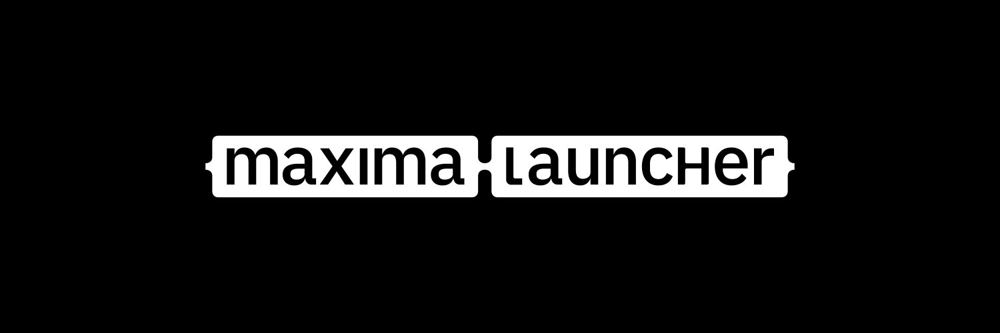

# Maxima
## A free and open-source replacement for the EA Desktop Launcher

[!WARNING]
Maxima is in beta. Parts of it may not be fully stable, and we're actively fixing bugs and adding features. Please create an issue if you notice strange behavior.

Maxima is an open-source replacement for the EA Desktop/Origin game launcher, running natively on Linux and Windows, with MacOS support in progress.

Maxima itself is a library (`maxima-lib`), with povided CLI (`maxima-cli`), TUI (`maxima-tui`), and GUI (`maxima-ui`) frontends. Other launchers compatible with Maxima's license may implement it as a backend. It's used by our sister project, [KYBER](https://uplink.kyber.gg/news/features-overview).

**Features:**
 - EA Authentication
 - Downloading/Updating games
 - Download & Play any build of a game
 - DRM & Licensing support
 - Multiplayer game support
 - Syncing EA cloud saves
 - Launch EA games owned on Epic/Steam through Maxima directly
 - Playing games installed with EA Desktop on Maxima + vice versa
 - Displaying your in-game status to your friends, and viewing your friends' status'
 - Locating games
 - Running games under [wine-ge](https://github.com/GloriousEggroll/wine-ge-custom) on Linux/SteamDeck
   - `wine-ge` is automatically installed, but base `wine` must already be installed on the system. We're looking into implementing [umu-launcher](https://github.com/Open-Wine-Components/umu-launcher) to fix this.

**In-Dev:**
 - MacOS support
 - Support for launching Maxima through Epic/Steam

**Planned:**
 - Library documentation/examples
 - Full EA Desktop interopability. Games installed with EA Desktop already appear on Maxima, but to take it a step further we'd like the ability to, for example, start a download on EA Desktop and continuing it on Maxima.
 - Cleaner/Stabler downloader implementation
 - Progressive/Selective installs
   - Some games are able to start without being fully installed, and some games contain language-specific files.
- Support for the store (buying games)
 
**Unsupported:**
 - Battlefield 3 is currently unsupported due to how battlelog does game launching. This is on our radar, but isn't a huge priority at the moment.
   - Please file an issue if you find more games that don't work

# CLI Usage
`maxima-cli` standalone will launch an interactive CLI mode to install and launch games.

`maxima-cli help` will bring up the subcommand list, with things like `locate-game`, `cloud-sync`, `create-auth-code`, `list-friends`, etc.

## Why the name 'Maxima'?
It's the farthest you can get from the Origin.

## Maintainers:
 - [Sean Kahler](https://github.com/BattleDash) (Lib, Bootstrap, Service)
 - [Nick Whelan](https://github.com/headassbtw) (UI)
